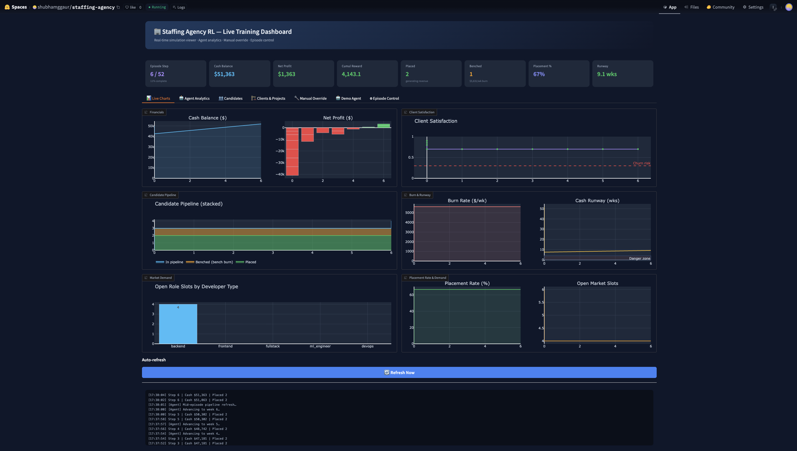
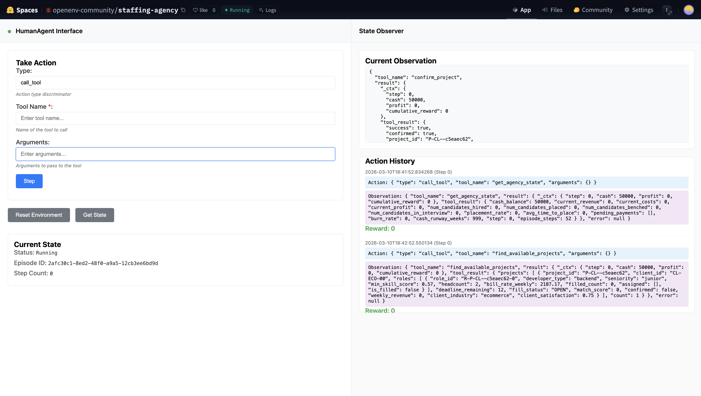
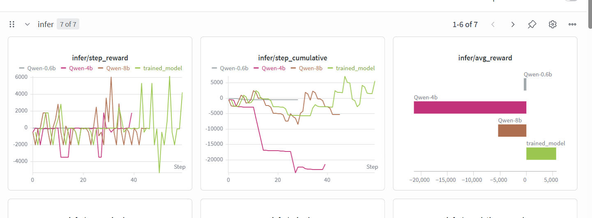

# StaffingGym: Teaching an LLM to Run a Staffing Agency with Reinforcement Learning

> **OpenEnv Hackathon — March 2026** · Multi-Agent Interactions + Long-Horizon Planning (Scale AI / Mercor sub-theme)
>
> An LLM agent acts as a **Staffing Agency CEO** managing multiple clients and candidates
> over a 52-week simulated business year. The agent must balance bench costs, candidate
> patience, project deadlines, and client satisfaction to maximise profit using real
> tool calls against a live environment server — no fabricated rewards.

---

## Why We Built This

This project didn't start at a hackathon. It started with frustration.

We've worked with staffing agencies to find the right talent for our teams. The process is painful — weeks of back-and-forth, mismatched candidates, lost time on both sides. The agency bleeds money keeping developers on the bench. The company bleeds money waiting for the right hire. Everyone loses.

The insight that wouldn't leave us alone: **what if one person with a laptop could spin up a staffing agency?** Not a job board. Not a matching algorithm. A full autonomous agent that sources, interviews, hires, and places developers into multi-role corporate projects — managing a real P&L the entire time.

We're building **RL Recruiters** — an autonomous RL-based environment inspired by the [VendingBench](https://arxiv.org/abs/2410.18572) model. Instead of stocking vending machines, our agents proactively source and "stock" developers to meet real-time demand. We handle all the interactions (actions, states) between the staffing agency, candidates, and clients. The goal: maximise the profit of the staffing agency.

---

## What Makes This Environment Interesting

| Property | Description |
|---|---|
| **Multi-Actor** | Agent manages N clients (demand) + M candidates (supply) simultaneously |
| **Long-Horizon** | 52 steps; multi-role projects take many weeks to seal → sparse reward |
| **Emergent Strategy** | Over-hiring bleeds cash; under-hiring loses clients → narrow optimal band |
| **Real Rewards** | Every reward comes from `env.step()` — interview costs, bench burn, billing margins, expiry penalties |
| **LLM-Graded Transitions** | Interview, fit, salary negotiation, client satisfaction via LLM judges |
| **OpenEnv Native** | MCPEnvironment + FastMCP + create_app — deployable to HF Spaces |
| **Live Config API** | PATCH `/config/env` hot-patches environment params without restarting the server |

The economics are brutal by design:

- **Bench burn**: Hired candidates sitting idle bleed $1,500–$2,500/week in salary with zero revenue. Cash depletes fast.
- **Gated revenue**: Multi-role projects only generate income when *every single role* is filled. Two out of three isn't good enough — it's $0 until you seal the deal.
- **Ticking deadlines**: Projects expire in 4–10 weeks. Miss the deadline and you eat the full billing opportunity as a penalty, plus your client's satisfaction tanks.
- **Client churn**: Let satisfaction drop below 0.3 and the client leaves forever — that's a $50,000 LTV penalty.

The agent starts with $50,000 in seed capital, 3 clients, a market pool of 20 candidates, and 52 weeks to prove it can turn a profit.

Training Dashboard  
- https://huggingface.co/spaces/shubhamggaur/staffing-agency

 

---

## The Problem It Solves

**Long-Horizon Planning for LLMs.** Most LLM benchmarks test single-turn reasoning. We push models beyond shallow responses — the agent must survive sparse, delayed rewards and manage a complex P&L over 52 steps, avoiding the trap of blindly hiring everyone.

**Decentralising HR Workflow.** Traditional staffing agencies are bloated and slow. We decentralise human capital routing so every solo freelancer can operate with the capacity of a million-dollar agency. The core decision loop — source, screen, match, place — compresses into an autonomous agent.

---

## The Agent Decision Loop

Every week, the agent follows an observe → decide → act → reward cycle using 19 tools:

**GET tools** (observe the world — free, no state change): `get_agency_state()`, `get_client_state()`, `get_candidate_state()`, `find_available_projects()`, `get_market_demand()`, and more.

**EXECUTE tools** (change the world — carry real economic consequences): `interview_candidate()` (−$500), `hire_candidate()` (−$2,000), `match_candidate_to_project()`, `let_go_candidate()` (−2× salary severance), `advance_week()` (main P&L signal), and others.

The agent starts blind. It must spend actions to "interview" candidates, triggering a background **LLM Judge** to score hidden skills (1–5) and flag culture risks. The agent generates **tool calls as JSON** — the same way you'd call an API. This makes it genuinely agentic RL, not just discrete action selection.

Environment  
- https://huggingface.co/spaces/openenv-community/staffing-agency



---

## Reward Design

We use a **hybrid reward** combining three layers of signal. Getting the balance wrong in any of them produces degenerate behaviour.

### Dense Rewards (per tool call)

| Action | Reward | Purpose |
|--------|--------|---------|
| `interview_candidate` | −$500 | Screening has a real cost |
| `hire_candidate` | −$2,000 | Onboarding investment |
| `match_candidate_to_project` ✅ | +margin_weekly | Immediate placement bonus |
| `match_candidate_to_project` ❌ | −$100 | Penalise invalid attempts |
| Consecutive passive GET calls | −$50/turn after 3 free | Prevents analysis paralysis |
| Same tool called twice in a row | −$100 | Discourages looping |

### Delayed Rewards (on `advance_week`)

These only materialise when the agent ticks the simulation clock forward:

- **+margin/week** per placed candidate (the bread and butter)
- **−salary/week** per benched candidate (the cash drain)
- **−bill_rate × weeks_remaining** when projects expire unfilled
- **−$50,000** when a client churns (satisfaction < 0.3)
- **+10% margin bonus** for sealing projects within 2 weeks

### Sparse Rewards (end of episode)

A **$50,000 win bonus** if cumulative profit exceeds $200,000. This is the long-horizon signal that only γ=0.99 discounting can propagate back to early decisions.

```
R(t) = immediate_tool_reward        ← dense, per action
     + world_tick_reward             ← delayed, per advance_week
     + invalid_action_penalty        ← dense, per failed action
     + win_bonus                     ← sparse, end of episode
```

**Why all three layers?** Without dense rewards, the agent gets no signal for 52 weeks and doesn't learn. Without delayed rewards, it doesn't learn bench burn and over-hires. Without sparse rewards, it doesn't optimise for episode-level profit.

---

## LLM-in-the-Loop Judges

We use LLMs as **judges** inside the environment at five call sites where probability distributions aren't enough:

- **`llm_interview()`** — Returns a 1–5 rating, red flags, and proceed/reject signal
- **`llm_project_fit()`** — Scores candidate-project compatibility based on industry, stack, and background
- **`llm_salary_negotiation()`** — Accept, reject, or counter based on competing offers and urgency
- **`llm_client_satisfaction()`** — Updates satisfaction with memory and personality
- **`llm_candidate_leave()`** — Per-step leave decision for impatient candidates

For reproducibility, all LLM outputs are cached by `(episode_seed, step, call_type, input_hash)` for deterministic RL trajectory replay.

---

## Training: REINFORCE + KL Penalty with LoRA

We use GRPO (Group Relative Policy Optimisation) — REINFORCE with discounted returns and a KL penalty against the reference model:

```python
# Discounted returns
G = 0
for t in range(T-1, -1, -1):
    G = reward[t] + γ * G        # γ = 0.99
    returns[t] = G

advantages = (returns - mean) / (std + ε)  # z-score normalisation
loss = -advantage * log_prob + kl_coeff * KL(π || π_ref)
```

Key training decisions:

- **γ = 0.99** — propagates sparse end-of-episode win bonus back to early hiring decisions
- **KL coefficient 0.05** — prevents policy drift while maintaining valid JSON generation
- **LoRA adapters only** (rank 16, alpha 32, all-linear) — base model frozen, KL computed by toggling adapters on/off

We also built in behavioural penalties to prevent degenerate policies: passive streak penalty (stops GET-tool spam), repeat call penalties (stops hire-fire cycling), and expiry penalties scaled by remaining billing opportunity (stops confirm-then-abandon strategies).

---

## Results: What the Models Actually Learned

We tested two model sizes: **Qwen3-0.6B** and **Qwen3-8B**.

### Qwen3-0.6B (600M parameters)

| Metric | Value |
|--------|-------|
| Mean profit | −$7,803 |
| Max profit | +$80,760 |
| Positive profit rate | 50% |

The small model struggled with frequent parse failures (broken `<tool_call>` tags), couldn't reason about type adjacency (fullstack → backend), and called tools with wrong IDs. But with **pre-computed state injection** — pre-calculating valid matches and injecting them into the prompt — it learned to copy-paste valid tool calls and occasionally found profitable placements.

### Qwen3-8B (8B parameters)

| Metric | Value |
|--------|-------|
| Mean profit (first episode) | +$61,329 |
| Total reward | +$57,781 |
| Parse failures | 0 |

Night and day. Zero parse failures. Followed the interview → hire → match pipeline correctly. Responded to pre-computed match suggestions immediately. **Profitable from episode one.**

The tradeoff: gradient checkpointing + per-sample backward on 80GB A100, ~79GB VRAM vs ~3GB for the 0.6B. Training speed: ~8s/step vs ~1s/step.

### Model Comparison

| Capability | Qwen3-0.6B | Qwen3-8B |
|---|---|---|
| Tool-call syntax | ❌ Frequent failures | ✅ Reliable |
| Multi-step pipeline | ⚠️ Needs hand-holding | ✅ Follows instructions |
| Type/seniority reasoning | ❌ Cannot do | ⚠️ With hints |
| Profit generation | ⚠️ 50% positive | ✅ Profitable ep1 |
| Training speed | ~1s/step | ~8s/step |
| VRAM (80GB A100) | ~3 GB | ~79 GB (grad ckpt) |
| **Recommended for** | Pipeline testing | **RL training** |



The trained model (green) shows dramatically higher step rewards and climbs to positive cumulative reward, while the untrained Qwen-4B (pink) collapses to −$20,000. The trained model is the only one in positive average reward territory.

---

## Degenerate Policies We Had to Defend Against

RL agents are optimisers, and optimisers find every loophole:

**Always-GET Policy** — Spams observation tools forever. Fix: passive streak penalty after too many consecutive GET-only turns.

**Confirm-Never-Fill** — Locks in projects then abandons them. Fix: expiry penalty at `bill_rate × weeks_remaining`.

**Hire-Fire Cycling** — Hire then immediately let go. Fix: $2K onboarding + 2× severance + repeat penalty.

**Always-Pass Policy** — Declines all projects to avoid risk. Fix: client churn + $50K LTV loss.

---

## Quick Start

```bash
# 1. Create venv
uv venv .venv && source .venv/bin/activate

# 2. Install
uv pip install -e ".[dev]"

# 3. Run tests (no server needed)
uv run pytest tests/ -v

# 4. Start the environment server
uv run python -m uvicorn server.app:app --host 0.0.0.0 --port 8000

# 5. Check health + config
curl http://localhost:8000/health
curl http://localhost:8000/config
```

---

## Training

### Dry Run (no GPU — validates the full HTTP stack)

```bash
uv run python training/train_grpo.py --dry_run --num_episodes 90

# Outputs:
#   training/reward_curves.png      ← random vs greedy vs optimal reward curves
#   training/metrics_summary.json   ← mean profit, positive rate per policy
```

### Full Training (GPU required)

```bash
# Install training dependencies
uv pip install -e ".[train]"

# Terminal 1 — environment server
uv run python -m uvicorn server.app:app --host 0.0.0.0 --port 8000

# Terminal 2 — training
uv run python training/train_grpo.py \
    --env_url http://localhost:8000 \
    --model_name Qwen/Qwen2.5-1.5B-Instruct \
    --num_episodes 200 \
    --output_dir training/checkpoints \
    --wandb_api_key YOUR_KEY
```

### Training from a YAML config file

```bash
uv run python training/train_grpo.py --config training/config.yaml
# CLI flags override YAML values when both are provided
uv run python training/train_grpo.py --config training/config.yaml --num_episodes 100
```

### Inference (no training, WandB logging)

```bash
# Terminal 1 — environment server
uv run python -m uvicorn server.app:app --host 0.0.0.0 --port 8000

# Terminal 2 — inference with base model
uv run python training/infer.py --no_adapter --num_episodes 5

# With LoRA checkpoint + WandB
uv run python training/infer.py \
    --checkpoint training/checkpoints \
    --num_episodes 10 \
    --wandb \
    --wandb_project myorg/staffing-agent
```

---

## Config API (live hot-patch)

The environment server exposes config endpoints that update parameters **without restarting the server**. Changes take effect for the next episode reset.

```bash
# View full config
curl http://localhost:8000/config

# Switch to curriculum stage 2 (live)
curl -X PATCH http://localhost:8000/config/env \
     -H "Content-Type: application/json" \
     -d '{"curriculum_stage": 2, "num_clients": 3, "max_roles_per_project": 2}'

# Relax penalties during early training
curl -X PATCH http://localhost:8000/config/env \
     -H "Content-Type: application/json" \
     -d '{"passive_streak_threshold": 6, "repeat_call_penalty": -50.0}'
```

All configurable fields are documented in `env/config.py`.

---

## Reward Flow (how rewards reach the training loop)

```
env.core.tool_*(...)
  → returns {"reward": X, "success": True, ...}
        ↓
_register_tools wrapper
  → env._last_tool_reward = X   # store before stripping
  → pops "reward" key           # agent never sees it in conversation
        ↓
staffing_environment.step()
  → tool_reward = self._last_tool_reward
  → total_reward = tool_reward + passive_penalty + repeat_penalty
  → CallToolObservation(reward=total_reward)
        ↓
client._parse_result()
  → result.reward = total_reward
        ↓
rollout_full_episode()
  → step_rewards.append(result.reward)
        ↓
reinforce.train_grpo()
  → discounted returns → advantages → policy gradient update
```

---

## Available Tools (19 total)

**GET (observation only — no reward, no state change):**

| Tool | Description |
|---|---|
| `get_agency_state` | Cash, revenue, costs, profit, burn, runway |
| `get_client_state` | Per-client or all-client satisfaction, projects |
| `get_candidate_state` | Pipeline, bench, churn risk candidates |
| `get_project_details` | Roles, deadline, fill status for one project |
| `get_candidate_profile` | Full profile of one candidate |
| `get_market_demand` | Open role slots by developer type |
| `get_financial_summary` | P&L snapshot |

**EXECUTE (carry reward, mutate state):**

| Tool | Reward Signal | Description |
|---|---|---|
| `find_available_projects` | 0 | Discover all open projects |
| `confirm_project` | 0 | Commit to a project (client satisfaction boost) |
| `find_candidate` | 0 | Search market by developer type |
| `interview_candidate` | **−$500** | Screen a candidate; reveals skills and salary |
| `hire_candidate` | **−$2,000** | Put on payroll (onboarding cost) |
| `negotiate_salary` | 0 | Adjust salary offer before hiring |
| `match_candidate_to_project` | **+speed bonus** | Place candidate; seals project when all roles filled |
| `let_go_candidate` | **−2× salary** | Remove from payroll (severance) |
| `request_project_extension` | 0 | Buy deadline time (satisfaction cost) |
| `pass_on_project` | 0 | Decline project (avoids expiry penalty) |
| `advance_week` | **main P&L** | Tick world: billing, bench burn, expiry, churn |

---

## Key Economics

| Scenario | Weekly Impact |
|---|---|
| Candidate placed (e.g., $3k bill − $1.4k salary) | +$1,600/wk margin |
| Candidate benched (salary still owed) | −salary/wk burn |
| New hire | −$2,000 one-time |
| Severance | −2× weekly salary |
| Project expiry (unfilled roles) | −large penalty per unfilled slot |
| Client churn (satisfaction < 0.3) | −$50,000 LTV |

**Break-even:** A $1,600/wk margin hire pays back $2,000 onboarding in 1.25 weeks.

---

## Curriculum Stages

| Stage | Clients | Dev Types | Max Roles/Project | Deadlines |
|---|---|---|---|---|
| 1 (easy) | 1 | 1 (backend only) | 1 | 8–14 weeks |
| 2 (medium) | 3 | 3 | 2 | 6–10 weeks |
| 3 (full) | 3+ | 5 | 3 | 4–10 weeks |

```bash
# At startup
CURRICULUM_STAGE=2 uv run python -m uvicorn server.app:app --port 8000

# Live hot-patch (no restart needed)
curl -X PATCH http://localhost:8000/config/env -H "Content-Type: application/json" \
     -d '{"curriculum_stage": 2}'
```

---

## LLM Mode

```bash
# Stub (default — no API key, fast, deterministic-ish)
LLM_MODE=stub uv run python -m uvicorn server.app:app --port 8000

# Live (uses local Ollama / vLLM for rich semantic evaluations)
LLM_MODE=live OPENAI_API_BASE=http://localhost:11434/v1 \
    uv run python -m uvicorn server.app:app --port 8000
```

---

## Architecture

### OpenEnv Stack

```
StaffingAgencyEnvironment (server/staffing_environment.py)
  └── MCPEnvironment (openenv-core)
        └── FastMCP tools (19 tools registered)
              ├── GET tools (7):    get_agency_state, get_client_state, ...
              └── EXECUTE tools (12): find_candidate, interview_candidate,
                                      hire_candidate, advance_week, ...

server/app.py
  └── create_app(StaffingAgencyEnvironment, CallToolAction, CallToolObservation)
        └── FastAPI with /reset /step /state /health /config /config/env /config/training /ws

client.py (StaffingAgencyEnv)
  └── EnvClient[StaffingAction, StaffingObservation, StaffingState]
        └── reset(), step(), state()  — sync + async
```

### Training Stack

```
training/
├── train_grpo.py    ← Entry point: parse_args() + dispatch to dry_run or reinforce
├── reinforce.py     ← REINFORCE-GRPO loop: rollout → returns → update
├── rollout.py       ← rollout_full_episode(): live 52-week env interaction
├── prompts.py       ← SYSTEM_PROMPT, TOOLS schema, parse_tool_call()
├── policies.py      ← Heuristic baselines: policy_random / greedy / optimal
├── dry_run.py       ← dry_run_simulate(): GPU-free validation via heuristic policies
└── metrics.py       ← plot_reward_curves(), save_metrics()
```

---

## File Structure

```
rl-recruits/
├── env/
│   ├── config.py            ← Config (env params) + TrainingConfig (training HPs)
│   ├── models.py            ← Candidate, Role, Project, Client dataclasses
│   ├── core.py              ← StaffingCore: all tool logic + world_tick()
│   ├── llm.py               ← LLMRouter: stub + live (Ollama/vLLM) implementations
│   └── simulation.py        ← World dynamics: arrivals, deadlines, patience, churn
├── server/
│   ├── staffing_environment.py  ← StaffingAgencyEnvironment(MCPEnvironment)
│   │                               Reward flow: _last_tool_reward pattern
│   └── app.py               ← create_app() + /config GET/PATCH endpoints
├── training/
│   ├── train_grpo.py        ← Entry point: parse_args + dispatch
│   ├── reinforce.py         ← REINFORCE-GRPO training loop
│   ├── rollout.py           ← rollout_full_episode() — live env interaction
│   ├── prompts.py           ← SYSTEM_PROMPT, TOOLS, parse_tool_call()
│   ├── policies.py          ← Heuristic baselines (random/greedy/optimal)
│   ├── dry_run.py           ← GPU-free validation simulator
│   └── metrics.py           ← Reward curve plots + JSON summaries
├── ui/
│   └── dashboard.py         ← Gradio dashboard (real cumulative_reward from server)
├── tests/
│   └── test_env.py          ← Environment unit tests
├── client.py                ← StaffingAgencyEnv(EnvClient) — sync + async
├── models.py                ← StaffingAction, StaffingObservation, StaffingState
├── openenv.yaml             ← OpenEnv manifest
├── pyproject.toml
└── README.md
```

---

## Training Expectations & Tips

| Episodes | Expected Behaviour |
|---|---|
| 1–10 | Model learns basic tool-call syntax; rewards mostly negative |
| 10–50 | Learns to call `advance_week`; starts seeing positive billing rewards |
| 50–200 | Learns to avoid benching; salary negotiation and project selection improve |
| 200+ | Systematic profit maximisation: demand-aware hiring, deadline management |

**Making training faster:**

| Technique | How |
|---|---|
| Smaller model | `--model_name Qwen/Qwen2.5-1.5B-Instruct` |
| Shorter episodes | `CURRICULUM_STAGE=1` (fewer projects, faster sealing) |
| Fewer turns/week | `--max_turns_per_step 5` (forces faster decisions) |
| Parallel env instances | Deploy multiple server replicas on different ports |
| LoRA fine-tuning | Add `peft` + use `get_peft_model()` in reinforce.py |
| vLLM inference | Replace `model.generate()` in rollout.py with vLLM async API |

---

## What's Next

1. **Full training run on Qwen3-8B** — OOM resolved, prompt truncation bug fixed (2,048→4,096 tokens). Time to let it run.
2. **Curriculum learning** — start with 1 client / 1 dev type, scale to full 3-client, 5-type, multi-role environment.
3. **Open-source benchmark release** — eval suite, leaderboard, and community RFCs.
4. **Multi-objective exploration** — Pareto-front over profit vs. client satisfaction vs. candidate welfare.

---

## Judging Criteria Alignment

| Criterion | How We Address It |
|---|---|
| **Environment Innovation (40%)** | Multi-actor (clients + candidates), sparse multi-role sealing, LLM-graded transitions, 52-step horizon, live config API |
| **Storytelling (30%)** | Clear CEO framing, economic tensions, rich tool descriptions |
| **Reward Improvement (20%)** | `--dry_run` shows random→greedy→optimal curves; REINFORCE with per-step env rewards |
| **Training Pipeline (10%)** | Custom REINFORCE loop with KL penalty, discounted returns, W&B logging |

---

*Built with caffeine and conviction at the OpenEnv Hackathon. StaffingGym is part of the OpenEnv ecosystem for agentic RL research. We're just getting started.*